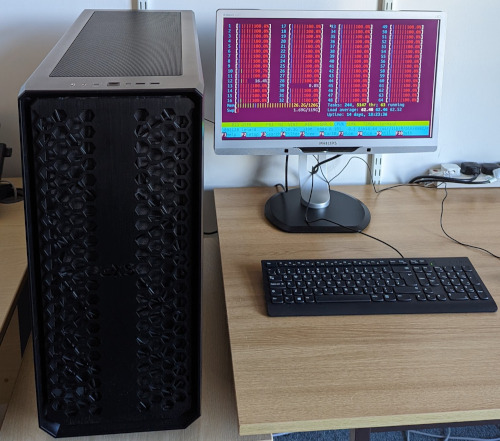

DeepSim is a multi-user Linux workstation for CPU- and GPU-intensive compute jobs, which first came available in April 2022. 
It has a 64-thread CPU, 128GB RAM, 2 x RTX3090 24GB GPUs, and 6TB storage.

Further details, including how to log on, are on the private github repo [deepsim](https://github.com/ajwills72/deepsim). Request access to this repo from Andy Wills.

